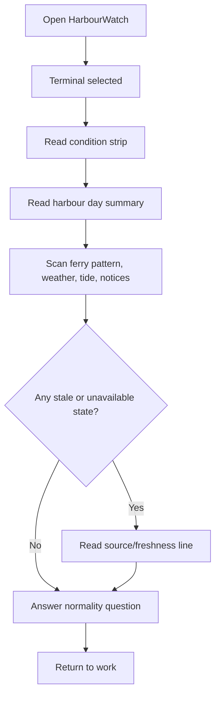
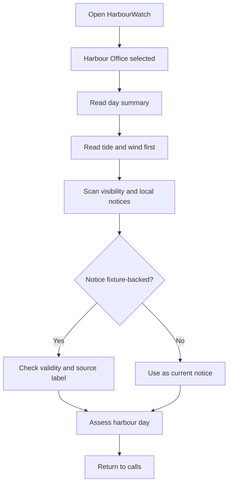
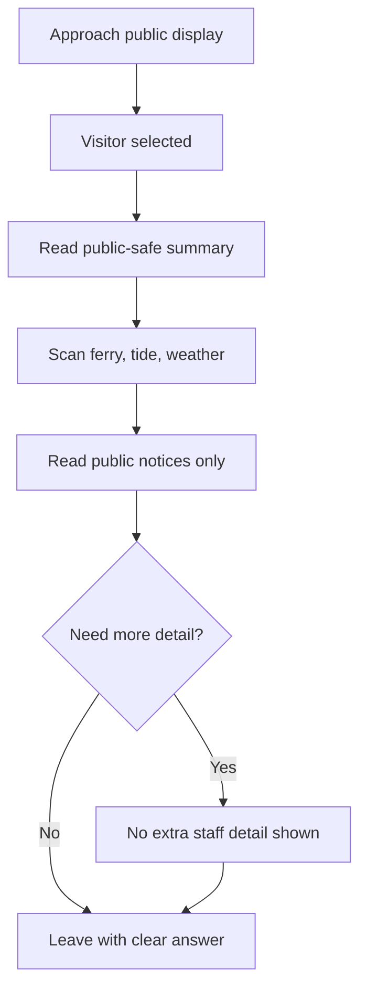
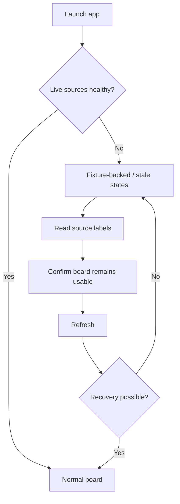

# UX Design Specification bmad-6-workshop

**Author:** Dicky
**Date:** 2026-04-29

---

<!-- UX design content will be appended sequentially through collaborative workflow steps -->

## Executive Summary

### Project Vision

HarbourWatch Phase 1 is a calm, local-only Seattle waterfront conditions display for shared orientation. It helps ferry-terminal teams, harbour-office staff, and visitors understand the shape of the harbour-side day in roughly ten seconds: tide direction, wind and weather, ferry service pattern, local notices, source freshness, and any degraded data states.

The UX must stay close to the supplied Vibrant Maritime mock-ups in visual language, not in operational meaning. Preserve the high-contrast maritime palette, Deep Sea Blue structure, Safety Orange emphasis, Fog White surfaces, crisp borders, technical uppercase labels, compact status modules, 8px rhythm, and strong left-edge accents. Replace mock-up elements that imply command, tracking, surveillance, dispatch, or control: "Command Center", "Live Tracking", "Vessel Data", "Safety Logs", vessel manifests, vessel positions, vessel maps, reset actions, and instruction-like status language.

The intended first impression is a Seattle harbour-office conditions board: situated, legible, source-aware, and observational.

### Target Users

Terminal users need a fast normality check. Their first screen should prioritize ferry service pattern, waterfront condition strip, passenger-facing notices, material weather/tide variance, and source freshness.

Harbour-office users need the practical shape of the day. Their first screen should prioritize tide window, wind direction and gusts, visibility/weather, local dock or service notices, and visitor-facing advisory context. Ferry information remains visible but secondary.

Visitor users need a reduced public-safe display. Their first screen should prioritize a plain waterfront summary, next tide or tide direction, mild weather language, ferry delay/service pattern where relevant, and only experience-affecting public notices. Internal maintenance, berth capacity, staff labels, raw provider state, and diagnostics are excluded.

Workshop/demo operators need the display to remain credible when live APIs fail or credentials are absent. Their success case is not a hidden diagnostic view; it is a normal-looking product surface where stale, unavailable, and fixture-backed states are clear and calm.

### Key Design Challenges

The main UX challenge is preserving the supplied visual energy while removing cues that imply operational authority. Terms and surfaces such as command center, vessel tracking, live vessel maps, safety logs, reset controls, vessel manifests, and dispatch-like terminology must be replaced with observational, source-aware waterfront condition language.

A second challenge is role-specific hierarchy. Terminal, harbour-office, and visitor views must feel deliberately different in emphasis and disclosure, not like one generic dashboard with fields hidden.

A third challenge is data-state design. Fresh, stale, unavailable, and fixture-backed states need distinct treatments that preserve layout stability and trust without exposing raw provider errors, credentials, stack traces, or diagnostics.

A fourth challenge is public disclosure. Visitor mode must be designed as its own reading experience, not as a staff view with sensitive details removed.

### Design Opportunities

HarbourWatch can stand out through synthesis rather than density: a condition strip and harbour day summary should answer "what kind of waterfront day is this?" before panels provide detail.

The supplied mock-ups provide a strong visual foundation: deep navy structure, safety-orange emphasis, clean card geometry, technical uppercase labels, and tide/weather status modules can make the app feel situated and distinctive.

The product can make graceful degradation a UX strength. Fixture labels, stale-state panels, and unavailable-source messages can reinforce trust when handled as normal display states.

The role views can turn one data model into three clear experiences: terminal normality, harbour-office day shape, and visitor-safe waterfront orientation.

## Core User Experience

### Defining Experience

The defining experience is a ten-second waterfront read on one primary screen. A user should confirm the selected role view and understand the current harbour-side day without drilling into raw feeds, maps, diagnostics, settings, or operational controls.

The Phase 1 interaction model is deliberately small: one screen, three role views, four data states, and two user actions.

- One screen: the primary display contains the condition strip, harbour day summary, role-prioritized panels, and source/freshness line.
- Three role views: Terminal, Harbour Office, and Visitor.
- Four data states: fresh, stale, unavailable, and fixture-backed.
- Two user actions: switch role and refresh.

The experience succeeds when users can answer their role-specific question quickly:

- Terminal: "Is the waterfront broadly normal, and is ferry service materially affected?"
- Harbour office: "What shape is the tide, wind, visibility, and local-notice day?"
- Visitor: "What should I know about the waterfront and ferry context right now?"
- Demo operator: "Does the product still look credible when live sources are stale, unavailable, or fixture-backed?"

### Platform Strategy

HarbourWatch is a local web app designed primarily for desktop, laptop, and lobby-display contexts, with responsive support for visitor-scale viewing. It is not a mobile-first trip planner and should not become a route-planning app.

Primary input is mouse/keyboard on desktop and occasional touch on tablet or display hardware. Interaction density should remain low and fixed for Phase 1: role switcher and refresh. Phase 1 should avoid settings panels, account flows, admin controls, modal workflows, panel drill-downs, maps, route planners, diagnostic views, and investigative interactions.

The UI should render useful fixture-backed content without network access and should degrade gracefully when live sources fail. Offline or fixture-only mode is part of the normal experience model, not a hidden developer mode.

### Effortless Interactions

Role switching should be instant and visually obvious. Switching role view changes hierarchy, disclosure, and wording while preserving the overall screen structure. Users should always know whether they are viewing Terminal, Harbour Office, or Visitor.

Refresh should update the aggregate harbour summary without clearing the current readable display. Pending refresh should preserve existing stale, fixture, or last-known content until the new state is ready.

Freshness interpretation should require no effort. Fresh, stale, unavailable, and fixture-backed states should use consistent labels, visual treatments, and source lines across panels.

The first screen should do the synthesis work automatically. Users should not need to compare tide, weather, ferry, and notice panels to infer the overall waterfront condition; the condition strip and harbour day summary should state it plainly.

### Critical Success Moments

The first success moment is the initial glance. If the first screen does not answer "what kind of waterfront day is this?", the product has drifted into a generic dashboard.

The second success moment is role fit. Terminal users must see ferry pattern and passenger-facing variance first; harbour-office users must see tide, wind, visibility, and local notices first; visitors must see only public-safe orientation.

The third success moment is refresh and degradation. When a user refreshes, the display should not blank out or expose technical state. When a source is stale, unavailable, or fixture-backed, the display should remain calm, stable, and trustworthy.

The fourth success moment is boundary protection. Users should never feel the app is tracking vessels, authorizing action, controlling operations, or exposing internal staff data in public mode.

### Experience Principles

One screen before more screens. The primary display must carry the whole Phase 1 value before any additional surface is considered.

Two actions are enough. Role switch and refresh are the only Phase 1 user actions; everything else is automatic synthesis.

Lead with synthesis, then detail. The condition strip and harbour day summary carry the product value; panels support the read.

Preserve visual closeness, reject operational meaning. Keep the Vibrant Maritime style, but replace command, tracking, dispatch, and surveillance concepts with observational waterfront condition language.

Different roles deserve different hierarchy. Role views should change prominence, disclosure, and wording, not merely hide fields.

Make data honesty ambient. Source, freshness, stale, unavailable, and fixture states should be clear enough to build trust and quiet enough not to become diagnostics.

## Desired Emotional Response

### Primary Emotional Goals

The primary emotional goal is calm confidence through fast comprehension. HarbourWatch should make users feel that the waterfront day is understandable at a glance, even when some sources are stale, unavailable, or fixture-backed.

Calm does not mean muted, vague, sparse, or low contrast. It means the display is selective, structured, and steady. Confidence comes from seeing the right signal in the right place with enough source, freshness, and Seattle context to trust the read.

The experience should feel observant, local, trustworthy, and practically useful. It should not feel thrilling, tactical, urgent, gamified, decorative, or command-oriented. The desired reaction is: "I understand the harbour day well enough to orient myself or answer a simple question."

For staff users, confidence comes from hierarchy, specificity, and source honesty. For visitors, confidence comes from plain language, useful context, and public-safe filtering. For demo operators, confidence comes from graceful degradation that still looks intentional.

### Emotional Journey Mapping

On first arrival, users should feel situated. The display should immediately read as Seattle waterfront context through place names, weather/tide language, ferry context, and the Vibrant Maritime visual system.

During the core experience, users should feel focused. The condition strip and harbour day summary should reduce the need to compare panels manually. Role-specific hierarchy should make the current view feel made for the user's context.

After the ten-second read, users should feel settled and informed. They should know whether the day is broadly typical, what variance matters, what source state deserves caution, and which notice, if any, affects their context.

When something goes wrong, users should feel informed rather than alarmed. Stale, unavailable, and fixture-backed states should look like designed product states, not errors or broken panels.

On return, users should feel familiarity. The structure should be stable enough that repeated use becomes a quick scan rather than a fresh interpretation task.

### Micro-Emotions

Confidence over confusion: users should know what the display is saying and which role view they are in.

Trust over skepticism: every important signal should carry enough source and freshness context to feel honest.

Focus over anxiety: visual emphasis should be reserved for material variance, selected role state, refresh, and degraded data states, not constant alerts or aggressive status color.

Useful specificity over tasteful vagueness: summaries should include numbers, timestamps, and place names when they sharpen the read.

Satisfaction over spectacle: HarbourWatch should feel useful, well-judged, and distinctive rather than surprising, playful, or dramatic.

Local belonging over generic dashboard familiarity: Seattle waterfront references should make the product feel situated without becoming decorative.

Restraint over control: users should feel informed, not empowered to command, dispatch, clear, or direct operations.

### Design Implications

Calm confidence requires strong hierarchy, not low contrast. Use the mock-up palette's Deep Sea Blue, Safety Orange, Fog White, crisp borders, and uppercase labels to create clarity while avoiding alarm-heavy layouts.

Safety Orange should remain a structural emphasis color. Use it for role selection, refresh, key status markers, material variance, and selected data moments. Do not reserve it only for warnings.

Trust requires visible provenance. Source and freshness lines should be attached to panels and written in product language: "NOAA CO-OPS, updated 08:12", "Local fixture, valid today", "Ferry schedule source unavailable".

Focus requires selective emphasis. Buoy Red or error styling should be limited to unavailable states, critical source failures, or notices that truly need heightened attention.

Public comfort requires useful reduction, not over-softening. Visitor mode should remove staff-only labels, berth capacity, internal maintenance, detailed feed status, and technical diagnostics while preserving practical ferry, weather, tide, and public notice context.

Graceful degradation requires stable layouts. Panels should not disappear or collapse when data is stale or unavailable; they should shift copy and source state while preserving the overall screen rhythm.

### Emotional Design Principles

Make the first glance settling and specific. The top of the screen should answer the day-shape question with enough concrete detail to be useful.

Use confidence-building specificity. Include numbers, timestamps, place names, and source names where they improve trust, but avoid raw provider language.

Let calm still be vivid. The visual system can be high-contrast and maritime-specific without becoming a control room.

Treat degraded data as normal. Stale, unavailable, and fixture states should reassure users that the system knows what it does and does not know.

Avoid emotional overreach. Do not use language or visuals that create urgency, authority, surveillance, false precision, or fake control.

## UX Pattern Analysis & Inspiration

### Inspiring Products Analysis

The supplied Vibrant Maritime mock-up set is the primary inspiration source and should be treated as the visual source of truth for Phase 1. The app should stay close to these mock-ups in palette, density, typography, border treatment, accent bars, compact data modules, and maritime-industrial character.

The mock-ups are not authoritative for product semantics. Several labels and components imply a control-room or vessel-tracking product: "Command Center", "Live Tracking", "Live Operations Feed", "Vessel Data", "Safety Logs", vessel manifests, vessel maps, speed readouts, reset actions, and operational status language. These should be replaced while preserving the underlying visual composition where possible.

Transit departure boards are a secondary inspiration because they support fast public comprehension under time pressure. Their transferable strengths are stable layout, strong hierarchy, predictable labels, service pattern language, timestamps, and immediate recognition of disruption states. HarbourWatch should borrow the legibility and freshness discipline without becoming a trip planner.

Weather condition displays are a secondary inspiration because they turn complex environmental data into phrase-first summaries. Their transferable strengths are current-condition synthesis, short forecast phrases, icon-assisted scanning, and selective numeric detail. HarbourWatch should borrow phrase-first weather/tide communication without becoming a generic weather app.

Civic status pages are a secondary inspiration because they handle public-safe communication, notices, source attribution, and service degradation. Their transferable strengths are plain language, calm incident/status wording, and clear degraded states. HarbourWatch should borrow source honesty and notice structure without becoming a technical status dashboard.

Observability dashboards are a cautionary inspiration for data-state design. They are good at freshness, stale states, and source health, but often expose too much diagnostic logic. HarbourWatch should borrow the discipline of visible state while hiding raw provider internals.

### Transferable UX Patterns

Visual patterns to preserve from the mock-ups include Deep Sea Blue structural areas, Safety Orange emphasis, Fog White page backgrounds, crisp borders, left-edge accent bars, compact status cards, uppercase labels, and a dense single-screen rhythm.

Content patterns to preserve and correct include tide gauges, wind/visibility status modules, notice cards, data-state panels, source/freshness captions, role navigation, and waterfront imagery or locality markers. These should be rewritten into observational HarbourWatch language.

Interaction patterns should stay minimal. Role switch and refresh are the only Phase 1 actions. Any mock-up affordance that suggests opening vessel schedules, viewing vessel data, initiating resets, exploring maps, or drilling into logs should be removed or converted into passive display content.

Use a condition strip as the top-level summary pattern. It replaces a KPI row with a compact waterfront read covering role, ferry pattern, tide direction, wind/weather, notice state, and source confidence.

Use a harbour day summary as the synthesis pattern. It should state the day shape in plain language before users scan panels.

Use role-based hierarchy rather than configuration. Terminal, Harbour Office, and Visitor views should preserve the same visual system while changing order, prominence, disclosure, and wording.

Use panel-attached source lines. Each major panel should include quiet source/freshness text, making provenance visible without creating a diagnostics view.

Use stable degraded-state components. Fresh, stale, unavailable, and fixture-backed states should preserve card dimensions and placement so the display still feels intentional.

### Anti-Patterns to Avoid

Avoid literal vessel-tracking patterns from the mock-ups: vessel manifests, live tracking labels, vessel positions, route arrows, vessel maps, speed readouts, and ETA tracking. These conflict with the Phase 1 boundary.

Avoid command-center framing: Command Center, Live Operations Feed, Safety Logs, Initiate Reset, Node Active, and similar language should not survive into implementation.

Avoid map-first interaction. A small waterfront context band may be useful, but a tactical map, radar-style panel, glowing markers, or vessel route display would shift the product into surveillance and control territory.

Avoid generic dashboard drift. Equal-weight cards with no synthesis would weaken the product's purpose.

Avoid hidden staleness. A polished panel that looks current while its source is stale is worse than an honest stale state.

Avoid visitor over-disclosure. Visitor mode must not expose staff-only notices, berth capacity, non-public maintenance, detailed source state, or diagnostics.

Avoid over-softening. Public-safe does not mean vague; visitor mode still needs useful ferry, tide, weather, and notice context.

### Design Inspiration Strategy

Use a close-but-corrected strategy: stay visually close to the provided mock-ups while correcting language, hierarchy, and components that imply the wrong product.

Adopt the mock-ups' visual system: high contrast, compact modules, structural navy, safety-orange emphasis, Fog White backgrounds, crisp borders, left-edge accents, and strong typographic hierarchy.

Adapt the mock-ups' tide, wind, visibility, notice, and data-state components into HarbourWatch-specific condition panels. Keep their compact shape and visual rhythm, but replace operational language with source-aware observational language.

Adapt transit-board patterns for service pattern and disruption communication. Use "service pattern," "reported delay," "updated," and "notice" language rather than trip-planning flows.

Adapt weather-display patterns for phrase-first environmental summaries. Lead with "Elliott Bay breezy," "tide rising," "rain later," or "visibility unavailable," then provide numbers and timestamps where useful.

Adapt civic-status patterns for source honesty and degraded states. Use product-language states such as "NOAA CO-OPS, updated 08:12," "Local fixture, valid today," and "Ferry schedule source unavailable."

Reject operational maritime dashboard patterns. Anything that implies vessel control, surveillance, dispatch, clearance, routing, or safety authority should be replaced with observational waterfront condition language.

## Design System Foundation

### 1.1 Design System Choice

HarbourWatch should use a custom Vibrant Maritime design system implemented with Tailwind-style design tokens and a small set of reusable product components.

The visual source of truth is the mock-up set in `/home/dicky/bmad-6-workshop/docs/design`, corrected for product semantics. The app should not visually adopt Material Design, Ant Design, or a generic dashboard kit.

The design system has two jobs:

1. Preserve close visual fidelity to the supplied mock-ups.
2. Prevent semantic drift into command-center, vessel-tracking, dispatch, surveillance, or control UX.

### Rationale for Selection

A generic established system would speed up development but would weaken the maritime-industrial character that the mock-ups already define.

A broad bespoke design system would preserve uniqueness but create unnecessary Phase 1 overhead.

A small custom system built on Tailwind-style tokens is the right fit because HarbourWatch needs distinct visual language, a one-screen interaction model, stable data-state treatment, and strong semantic guardrails.

This approach also keeps implementation practical. Developers can encode the supplied colors, typography, spacing, borders, and state variants as tokens, then build only the product components needed for the primary display.

### Implementation Approach

Implement the design system as tokens plus six core product components.

Design tokens should include:

- Colors: Deep Sea Blue, Safety Orange, Buoy Red, Fog White, layered cool neutrals, outline, source/freshness muted text, and state colors.
- Typography: Epilogue for headings; Work Sans for body, labels, captions, and data text.
- Spacing: 8px rhythm with compact single-screen density.
- Radius: small engineered corners, not soft generic cards.
- Borders: crisp outlines and left-edge accent bars.
- States: fresh, stale, unavailable, fixture-backed, selected role, material variance, and pending refresh.

Core product components:

- App shell: compact top bar, product identity, role switcher, and refresh control.
- Condition strip: the top-level ten-second waterfront read.
- Harbour day summary: phrase-first synthesis for the selected role.
- Role panel grid: stable layout for tide, weather, ferry, notices, and source context.
- Source line: panel-attached provenance, freshness, fixture, stale, or unavailable wording.
- Degraded-state treatment: stable card variants for stale, unavailable, fixture-backed, and pending-refresh states.

Later-only components, if implementation proves they are needed:

- Dedicated tide gauge.
- Dedicated wind/visibility module.
- Waterfront context band.
- Notice list variants.
- Civic context item.

### Customization Strategy

Preserve these mock-up qualities:

- High contrast.
- Compact density.
- Deep Sea Blue structure.
- Safety Orange emphasis.
- Fog White and cool neutral surfaces.
- Crisp borders.
- Left-edge accent bars.
- Uppercase technical labels.
- Small-radius engineered geometry.
- Maritime-industrial character.

Correct these mock-up semantics:

- Replace "Command Center" with "Waterfront Conditions" or "HarbourWatch".
- Replace "Live Tracking" with "Service Pattern" or "Reported Ferry Context".
- Replace "Vessel Data" and vessel manifests with ferry service summaries and public/local notices.
- Replace tactical maps with a passive waterfront context band only if location context is necessary.
- Replace reset/control actions with refresh and source-state messaging.
- Remove speed, vessel position, ETA tracking, dispatch, safety-log, and control-oriented components.

The design system should make the intended path easy: build something visually close to the mock-ups, but semantically unmistakable as a calm Seattle waterfront conditions board.

## 2. Core User Experience

### 2.1 Defining Experience

The defining experience is the role-aware waterfront read. A user selects Terminal, Harbour Office, or Visitor, and HarbourWatch presents the same waterfront day through the hierarchy, language, and disclosure appropriate to that context.

The signature interaction is not a drill-down, map, chart, or command action. It is the moment the user sees that the screen is already organized around their question:

- Terminal: ferry pattern, passenger-facing variance, and waterfront normality.
- Harbour Office: tide, wind, visibility, local notices, and day shape.
- Visitor: public-safe waterfront orientation, ferry context, weather/tide, and experience-affecting notices.

The canonical first-screen anatomy is:

1. Compact app shell with HarbourWatch identity, selected role, role switcher, and refresh.
2. Condition strip for the ten-second waterfront read.
3. Harbour day summary in phrase-first language.
4. Role-prioritized panel grid for tide, weather/wind/visibility, ferry service pattern, notices, and source context.
5. Quiet source/freshness line integrated with panels or the lower portion of the display.

If this works, users do not feel they are operating software. They feel they are reading the right conditions board.

### 2.2 User Mental Model

Users arrive with a noticeboard or departure-board mental model, not a control-system mental model. They expect the display to summarize current context, show what changed or matters, and identify whether the information is current.

Terminal users are used to checking service status, schedules, alerts, passenger flow, and weather context across separate sources. Their mental shortcut is: "Tell me whether anything material affects the day."

Harbour-office users are used to stitching together tide, wind, visibility, dock/service notes, and visitor questions. Their mental shortcut is: "Tell me the shape of the harbour day."

Visitors are used to public information displays, weather apps, and ferry notices. Their mental shortcut is: "Tell me what I need to know without exposing staff details."

Demo operators expect resilience. Their mental shortcut is: "Show me that the product still behaves when live data is imperfect."

Confusion happens if the UI looks like a vessel-tracking product, if role views appear too similar, if data freshness is hidden, if degraded states look broken, or if the primary screen begins with detailed cards before the condition strip and day summary.

### 2.3 Success Criteria

The defining experience succeeds when a first-time user can identify the selected role, read the condition strip and harbour day summary, and answer their role-specific question in roughly ten seconds.

Success indicators:

- The selected role is unmistakable.
- The first screen follows the canonical anatomy.
- The condition strip and harbour day summary appear before detailed panels.
- Role switching changes hierarchy, wording, disclosure, and emphasis while preserving visual structure.
- The same core modules can support all three roles without pretending all roles need the same prominence.
- Fresh, stale, unavailable, and fixture-backed states are understandable without diagnostics.
- The visual design remains close to the mock-ups while avoiding command, tracking, dispatch, and control semantics.
- Visitor mode never exposes internal staff context.
- Refresh preserves the current readable display while a new aggregate summary is pending.

The experience fails if users must compare several panels manually before understanding the day, if the interface feels like a generic dashboard, if role views are only cosmetic, or if the display implies operational authority.

### 2.4 Novel UX Patterns

The interaction model uses established patterns: segmented role switching, status-board hierarchy, condition summaries, card grids, source captions, and refresh.

The novelty is in combining those patterns into a situated harbour conditions board:

- Role views are reading modes, not user accounts or configuration.
- Source freshness is product content, not diagnostics.
- Fixture-backed data is openly labeled, not disguised as live.
- Degraded states are normal display states, not error screens.
- The same module set is re-prioritized for different audiences.
- The mock-up style is preserved while the product semantics are corrected.

No user education should be required. Users should understand the role switcher, summary, panels, and source lines from familiar public-display and dashboard conventions.

### 2.5 Experience Mechanics

Initiation begins on the primary display. The user sees the HarbourWatch identity, current selected role, role switcher, refresh control, condition strip, harbour day summary, and role-prioritized panels.

Interaction is limited to two actions:

1. Switch role view.
2. Refresh the aggregate summary.

When a user switches role, the screen preserves the same visual system and the same core module set but changes panel order, summary wording, notice disclosure, and emphasis. The transition should feel immediate and stable, not like navigating to a different app.

When a user refreshes, the current display remains readable while pending state is shown quietly. Panels should not blank out. New fresh, stale, unavailable, or fixture states replace prior states only when the aggregate summary is ready.

Feedback comes from selected role styling, updated timestamps, source lines, state labels, and stable panel treatments. Users know the product is working because the screen tells them what is fresh, what is stale, what is unavailable, and what is fixture-backed.

Completion is the ten-second answer. The user does not need a submit action, confirmation screen, or next step. They have read the board and can return to their work, visit, or demo.

## Visual Design Foundation

### Color System

Use the supplied Vibrant Maritime color system as the source of truth.

Core tokens:

- Deep Sea Blue / Primary: `#001629`
- Primary container: `#002b49`
- Safety Orange / Secondary: `#aa3000`
- Secondary container: `#d43f00`
- Buoy Red / Error: `#ba1a1a`
- Fog White / Background: `#f7fafc`
- White surface: `#ffffff`
- Layered neutral surfaces: `#f1f4f6`, `#ebeef0`, `#e5e9eb`, `#e0e3e5`
- Primary text: `#181c1e`
- Muted text: `#42474d`
- Outline: `#73777e`
- Outline variant: `#c3c7ce`

Semantic use:

- Deep Sea Blue anchors structure: headings, left accent bars, top/footer areas, panel borders, and the most stable hierarchy.
- Safety Orange is the emphasis color for selected role, refresh, key status markers, and material variance.
- Buoy Red is reserved for unavailable states, critical source failures, or notices requiring heightened attention.
- Fog White and cool neutral surfaces create the calm harbour-office backdrop.
- Muted text and outline colors carry source/freshness metadata without turning them into diagnostics.
- Use color sparingly and consistently so the screen reads as calm but not washed out.

State mapping:

- Fresh: normal panel treatment with quiet source line.
- Stale: muted blue/grey treatment with explicit stale copy.
- Unavailable: Buoy Red or error-container treatment, used sparingly.
- Fixture-backed: neutral or primary-tinted treatment with clear `Local fixture` or `Demo fixture` wording.
- Pending refresh: preserve current panel content with a quiet pending indicator.

### Typography System

Use the supplied type pairing:

- Headings: Epilogue.
- Body, labels, captions, source lines, and data text: Work Sans.

Type roles:

- Primary display heading: Epilogue 40px / 48px / 700 for large desktop contexts, scaled down responsibly for mobile.
- Section heading: Epilogue 32px / 38px / 700.
- Panel heading: Epilogue 24px / 30px / 600.
- Large body or summary copy: Work Sans 18px / 28px / 400.
- Standard body: Work Sans 16px / 24px / 400.
- Compact body and source text: Work Sans 14px / 20px / 400.
- Technical labels: Work Sans 12px / 16px / 700, uppercase, with modest tracking.

Typography should feel technical, legible, and maritime-industrial without becoming militarized. Labels may use uppercase treatments from the mock-ups, but operational command language must be removed.

Use phrase-first hierarchy: the most important information should be readable as a sentence or compact phrase before users process numbers.

### Spacing & Layout Foundation

Use the mock-up spacing system with an 8px base rhythm:

- Base: 8px
- XS: 4px
- SM: 12px
- Gutter: 16px
- MD: 24px
- LG: 40px
- XL: 64px
- Page margin: 20px on compact screens

The layout should be dense and efficient, not airy or marketing-like. HarbourWatch is a working conditions display, so whitespace should clarify grouping rather than create a promotional feel.

Layout rules:

- One primary screen carries the Phase 1 value.
- Use the canonical anatomy: app shell, condition strip, harbour day summary, role-prioritized panel grid, source/freshness line.
- Keep the panel grid stable across roles and data states.
- Use crisp 1px or 2px borders and 4px left accent bars for hierarchy.
- Avoid nested cards, large hero layouts, floating sections, and decorative backgrounds.
- Use small engineered radius values: `0.125rem`, `0.25rem`, `0.375rem`, and `0.5rem`; reserve pill shapes for status badges only.
- Keep spacing compact enough that the screen feels like a working board, not a poster.

### Accessibility Considerations

Maintain strong contrast for all role labels, panel text, source lines, and degraded states. Calmness must not become low contrast.

Do not rely on color alone to communicate fresh, stale, unavailable, fixture-backed, selected role, or material variance. Pair color with labels, source text, icons where appropriate, and consistent placement.

Ensure visitor mode remains readable in public or lobby conditions: short lines, plain language, clear hierarchy, and no dense technical metadata.

Keep interactive targets large enough for desktop, laptop, and occasional touch use. Role switch and refresh should be visually obvious and reachable.

Degraded states must preserve layout and clarity. A stale or unavailable panel should communicate its state explicitly without collapsing, flashing, or exposing technical errors.

## Design Direction Decision

### Design Directions Explored

Seven layout directions were explored using the same Vibrant Maritime token system:

1. Board First - a classic status-board layout with a compact shell, condition strip, harbour day summary, and prioritized panel grid.
2. Summary Dominant - a quieter composition that pushes the harbour day summary higher and reduces visual noise.
3. Data Panel - a more explicit module structure with stronger separation between panels and source-state treatment.
4. Role Split - a visibly role-forward composition where Terminal, Harbour Office, and Visitor hierarchy shifts are obvious.
5. Compact Control Strip - a tighter layout for smaller displays with a stronger emphasis on glanceability.
6. Spacious Desk View - a more open desktop layout with additional breathing room and a slightly more editorial feel.
7. Resilience Board - a failure-state-forward direction that makes stale, unavailable, and fixture-backed states highly visible.

### Chosen Direction

Direction 1, Board First, is the primary visual direction and the default screen model for HarbourWatch.

### Design Rationale

Board First best supports the defining experience: a ten-second role-aware waterfront read on one primary screen. It places the condition strip and harbour day summary before everything else, then supports them with a stable role-prioritized panel grid.

The key advantage is ordering discipline. HarbourWatch must answer the day-shape question immediately, and Board First makes that behavior structural rather than optional. It is the most reliable way to keep the experience calm, legible, and aligned with the supplied mock-ups without sliding into a generic dashboard.

This direction also supports the product's emotional goals. It can feel steady and specific without becoming dense, and it lets the same core modules serve all three roles without changing the underlying screen model.

The other directions remain useful as reference points:

- Summary Dominant informs calmer hierarchy on smaller screens.
- Role Split informs responsive reordering by audience.
- Resilience Board informs stale, unavailable, and fixture-backed states.
- Compact Control Strip informs lobby-display constraints.
- Spacious Desk View informs desktop breathing room.
- Data Panel informs explicit state treatment.

### Implementation Approach

Implement the Board First layout as the default app shell and screen anatomy:

- Compact top shell with HarbourWatch identity, selected role, role switcher, and refresh.
- Condition strip as the first content row.
- Harbour day summary directly below the strip.
- Role-prioritized panel grid for tide, weather, ferry service pattern, notices, and source context.
- Quiet source/freshness line integrated into the panel area or footer line.

Use the other directions as subordinate references, not alternate product models.

- Summary Dominant informs calmer hierarchy on smaller screens.
- Role Split informs audience-specific ordering.
- Resilience Board informs degraded states.
- Compact Control Strip informs smaller display constraints.
- Spacious Desk View informs desktop spacing.
- Data Panel informs source-state clarity and panel labeling.

## User Journey Flows

### Terminal Duty Supervisor: Ten-Second Normality Check

Maya opens HarbourWatch at Colman Dock before the passenger rush. The board defaults to Terminal, so the first read is ferry pattern, passenger-facing variance, waterfront normality, and notices that affect communication.

The flow is optimized for a quick answer, not exploration. Maya reads the condition strip, checks the harbour day summary, then glances at ferry service pattern, tide/wind/weather, and source freshness. If the board shows a stale or fixture-backed state, she uses the source line to decide whether the read is still safe to use for shared orientation.

Success means Maya can answer "Is anything materially affecting the waterfront or passenger day?" in one glance.

### Harbour-Office Staff: Shape of the Harbour Day

Jon checks HarbourWatch before handling marina and harbour-office calls. Harbour Office rises to the top, so tide, wind, visibility, and local notices carry the most weight while ferry context stays secondary.

The flow starts the same way as Terminal, but the hierarchy changes the read. Jon scans the day summary first, then looks at tide window, wind, visibility, and staff-local notices such as dock capacity or service closures. Fixture labels matter here because they tell him which notices are local and which are live.

Success means Jon can answer "What shape is the harbour day, and what local notices matter?" quickly and confidently.

### Visitor or Ferry Passenger: Public-Safe Waterfront Read

Elena looks at the public display near Pier 50 and gets the reduced visitor view. The board keeps the same core modules, but the hierarchy and disclosure are pared back to public-safe information.

The flow starts with the summary, then the visitor scans ferry context, weather, tide, and any experience-affecting notice. Staff-only labels, berth capacity, internal maintenance, and technical diagnostics are excluded from the view, so Elena never has to decide what to ignore.

Success means Elena can answer "What do I need to know right now?" without seeing internal operational detail.

### Workshop Demo Operator: Live Source Failure

During a workshop, live feeds are imperfect or credentials are missing. HarbourWatch still loads because fixtures, cached values, and degraded states keep the board coherent.

The operator uses the board to prove that failure states are part of the product. They refresh the display, see stale or unavailable panels remain readable, and confirm that fixture-backed content is clearly labeled rather than masquerading as live data.

Success means the demo still feels intentional when live sources fail.

### Journey Patterns

Shared navigation pattern:

- Role selection is the primary navigation mechanism.
- Refresh is the only secondary action.

Shared decision pattern:

- Users decide whether to trust the current view based on source and freshness metadata.
- Users do not make operational decisions inside the product.

Shared feedback pattern:

- The board stays stable while state changes.
- Fresh, stale, unavailable, and fixture-backed states are always explicit.

Shared content pattern:

- Condition strip first.
- Harbour day summary second.
- Supporting panels third.
- Source/freshness line always present.

### Flow Optimization Principles

Minimize steps to value. The board should answer the role-specific question in one glance.

Keep the same screen model across roles. Only order, emphasis, and disclosure should change.

Treat degraded states as normal. Do not hide them, collapse them, or turn them into technical failures.

Preserve visible context during refresh. Users should never lose the read they already have.

Keep journey depth shallow. HarbourWatch is a reading experience, not an exploratory workflow.

## Component Strategy

### Design System Components

The design system already provides the visual primitives HarbourWatch needs:

- App shell structure with compact top bar treatment.
- Buttons and icon-button patterns for refresh and other primary actions.
- Cards and panel surfaces with crisp borders and small-radius geometry.
- Chips and status badges for role, state, and source labels.
- Text hierarchy for headings, summaries, body copy, and source lines.
- Divider and border tokens for stable hierarchy.
- Spacing and layout tokens based on the 8px rhythm.

These primitives are enough to build the board-first layout without introducing a generic dashboard library or a control-room component set.

### Custom Components

### Condition Strip

**Purpose:** Present the top-line waterfront read in one compact row.

**Usage:** Always appears near the top of the primary screen, immediately after the app shell.

**Anatomy:** Four compact chips or cards for ferry pattern, tide, weather/wind/visibility, and notices.

**States:** Fresh, stale, unavailable, fixture-backed, selected role emphasis.

**Variants:** Desktop and compact lobby-display versions.

**Accessibility:** Each chip needs a clear label, state wording, and readable contrast. Do not rely on color alone.

**Content Guidelines:** Phrase-first summaries with short support text and optional timestamps.

**Interaction Behavior:** Read-only; updates when role changes or refresh completes.

### Harbour Day Summary

**Purpose:** State the day shape in a single sentence or short paragraph.

**Usage:** Sits directly under the condition strip and leads the screen.

**Anatomy:** Strong heading plus concise supporting copy.

**States:** Normal, stale-supported, fixture-supported, unavailable-summary.

**Variants:** Terminal, Harbour Office, and Visitor wording variants.

**Accessibility:** Use high-contrast typography and avoid overly dense sentence structure.

**Content Guidelines:** No command language, no control wording, no dense technical jargon.

**Interaction Behavior:** Read-only; updated by role switch and refresh.

### Role Switcher

**Purpose:** Let users switch between Terminal, Harbour Office, and Visitor views.

**Usage:** Part of the top shell and always visible.

**Anatomy:** Three mutually exclusive role controls.

**States:** Default, selected, focused, disabled when role is unavailable.

**Variants:** Inline segmented controls for desktop; condensed pill controls for smaller screens.

**Accessibility:** Must support keyboard navigation and clear selected-state announcement.

**Content Guidelines:** Short role labels only.

**Interaction Behavior:** Switching role reorders the same modules rather than navigating to a different page.

### Role-Prioritized Panel Grid

**Purpose:** Hold the supporting information panels in a stable board-first layout.

**Usage:** Follows the summary and contains tide, weather, ferry, notices, and source context.

**Anatomy:** Grid of panels with consistent spacing and left-edge accents.

**States:** Fresh, stale, unavailable, fixture-backed, emphasis.

**Variants:** Role-specific ordering without changing the component shell.

**Accessibility:** Panels must preserve reading order and work in a logical tab sequence.

**Content Guidelines:** Keep each panel focused on one signal family.

**Interaction Behavior:** Read-only; panel content updates with role and refresh.

### Data Source Line

**Purpose:** Show provenance and freshness in calm product language.

**Usage:** Attached to the bottom of panels or the lower screen area.

**Anatomy:** Provider label, freshness timestamp or fixture label, and concise state wording.

**States:** Fresh, stale, unavailable, fixture-backed.

**Variants:** Full line for desktop, shortened line for compact layouts.

**Accessibility:** Plain text first; icons only as support.

**Content Guidelines:** Examples such as "NOAA CO-OPS, updated 08:12" or "Local fixture, valid today".

**Interaction Behavior:** Non-interactive, but may update when refresh completes.

### Stable Degraded-State Panel

**Purpose:** Keep layout and trust intact when a source is stale, unavailable, or fixture-backed.

**Usage:** Wraps any panel that needs state-specific treatment.

**Anatomy:** Same structure as the normal panel with explicit state badge and adjusted copy.

**States:** Fresh, stale, unavailable, fixture-backed, pending refresh.

**Variants:** Stale emphasis, unavailable emphasis, fixture emphasis.

**Accessibility:** State must be visible in both color and text.

**Content Guidelines:** Never collapse the panel; make the state explicit.

**Interaction Behavior:** Updates in place without blanking the board.

### Refresh Control

**Purpose:** Trigger a new aggregate harbour summary.

**Usage:** Lives in the app shell alongside the role switcher.

**Anatomy:** Button or icon-button with refresh label.

**States:** Idle, hover, active, disabled, pending refresh.

**Variants:** Full label on desktop; icon-led compact version if needed.

**Accessibility:** Button role, keyboard support, and clear pending state announcement.

**Content Guidelines:** Keep the label short and non-technical.

**Interaction Behavior:** Updates the board without clearing the current read.

### Component Implementation Strategy

Build all HarbourWatch components from the existing design tokens and primitives rather than introducing a new UI library surface.

Foundation components:

- Shell, cards, buttons, chips, typography, borders, and layout tokens.

Custom components:

- Condition strip.
- Harbour day summary.
- Role switcher.
- Role-prioritized panel grid.
- Data source line.
- Stable degraded-state panel.
- Refresh control.

Implementation rules:

- Compose components from the same token set so role switching only changes ordering and emphasis.
- Keep panels read-only unless a future workflow explicitly requires interaction.
- Preserve the same component geometry across fresh, stale, unavailable, and fixture-backed states.
- Make the source line and state badge part of the standard component contract.
- Keep controls minimal so the screen remains a board, not a dashboard.

### Implementation Roadmap

Phase 1 - Core components:

- App shell.
- Role switcher.
- Refresh control.
- Condition strip.
- Harbour day summary.
- Role-prioritized panel grid.

Phase 2 - Supporting components:

- Data source line.
- Stable degraded-state panel.
- Notice panel variants.
- Tide and weather subpanels.

Phase 3 - Enhancement components:

- Compact lobby-display variant.
- Wider desktop variant.
- Optional waterfront context band if needed for orientation.

## UX Consistency Patterns

### Button Hierarchy

**When to Use:** Use buttons only for the two primary interactions in Phase 1: role switching and refresh.

**Visual Design:** Safety Orange for the primary action when one action is emphasized, Deep Sea Blue for stable shell actions, and muted outlined styles for secondary utility if needed. Buttons should stay compact, rectangular, and engineered rather than pill-heavy.

**Behavior:** Primary actions should be instant and predictable. Refresh should preserve the current board while the new summary loads. Role switching should change hierarchy without navigating away.

**Accessibility:** Buttons must have clear labels, keyboard focus states, and distinct selected-state feedback. Do not rely on color alone.

**Mobile Considerations:** Use full-width or near-full-width controls in compact layouts so role switching and refresh remain obvious on touch hardware.

**Variants:** Selected role, idle, hover, focus, active, and pending refresh.

### Feedback Patterns

**When to Use:** Use feedback for freshness, degraded states, refresh progress, and role selection.

**Visual Design:** Fresh states remain calm and neutral. Stale states use muted treatment plus explicit stale wording. Unavailable states use Buoy Red sparingly. Fixture-backed content uses a clear local fixture label.

**Behavior:** The board should never blank out during updates. Pending refresh should preserve the current readable state until the new summary arrives.

**Accessibility:** Feedback must be readable in text as well as color. State labels should be visible in the panel itself or the source line.

**Mobile Considerations:** Keep feedback short and stacked vertically so it remains readable on smaller screens.

**Variants:** Fresh, stale, unavailable, fixture-backed, pending refresh, selected role.

### Form Patterns

**When to Use:** Phase 1 has no user-entered forms. The board is read-first, not input-first.

**Visual Design:** Avoid exposing forms unless a future workflow explicitly requires one. Do not introduce search, filter, or settings forms into the main board.

**Behavior:** If future forms are added, they should be minimal, inline, and tied to a specific workflow rather than a general settings surface.

**Accessibility:** Future forms should use standard labels, inline validation, and keyboard-first behavior.

**Mobile Considerations:** Keep any future form controls compact and directly adjacent to the content they affect.

**Variants:** None in Phase 1.

### Navigation Patterns

**When to Use:** Navigation is limited to selecting the role view and occasionally refreshing the board.

**Visual Design:** Role switcher functions like a segmented control or compact tab row. It should be visible in the shell and always easy to read.

**Behavior:** Switching role changes module order, wording, and disclosure but keeps the same screen model. There is no deep navigation, no route planning, and no nested page hierarchy in Phase 1.

**Accessibility:** Role selection must be keyboard accessible and clearly announced as the current context.

**Mobile Considerations:** Role controls should condense gracefully without hiding the selected state.

**Variants:** Terminal, Harbour Office, Visitor, selected, and disabled if ever required.

### Additional Patterns

**Source Line Pattern:** Every major panel should carry a calm source line that explains provenance and freshness in product language.

**Condition Strip Pattern:** The condition strip always appears before detailed panels and carries the ten-second read.

**Stable Board Pattern:** The layout should preserve geometry across fresh, stale, unavailable, and fixture-backed states.

**Role-Reordering Pattern:** All roles use the same components, but the ordering and emphasis change by audience.

**No Overlay Pattern:** Avoid modal overlays and interruption patterns unless a future workflow explicitly requires them. The default behavior should be visible, calm, and stable.

### Design System Integration

These patterns are direct expressions of the chosen Vibrant Maritime design system. Buttons, chips, panels, typography, and spacing all use the same token set; the patterns define how to combine them consistently.

Custom rules:

- Keep role switching and refresh as the only Phase 1 controls.
- Keep all feedback states explicit and text-backed.
- Keep the board stable during loading and refresh.
- Keep visitor mode reduced and public-safe.
- Keep the condition strip and summary above detailed panels.

### Pattern Library Strategy

Document patterns as composable rules rather than large interaction systems. HarbourWatch needs a small, strict set of patterns that keep the board readable under normal, stale, and unavailable conditions.

Implementation notes:

- Prefer reusable shell, card, and status components over special-case variants.
- Use the same pattern language across all three roles.
- Preserve the same layout rhythm in fresh and degraded states.
- Treat source/freshness as a standard part of the panel contract.

## Responsive Design & Accessibility

### Responsive Strategy

HarbourWatch is primarily a desktop and lobby-display product, with responsive support for tablet and smaller visitor-scale screens.

Desktop strategy:

- Keep the board-first layout as the default.
- Use the full canonical anatomy: app shell, condition strip, harbour day summary, role-prioritized panels, and source line.
- Use a two-column or asymmetric grid where the summary and the highest-priority panel group remain above the fold.
- Preserve visible density so the board feels like an operational reading surface, not a marketing page.

Tablet strategy:

- Collapse to a simpler stacked or near-stacked layout.
- Keep the condition strip and summary first, then prioritize the most important panels for the selected role.
- Maintain large enough touch targets for role switching and refresh.
- Reduce ornamental spacing, but keep the same hierarchy and semantic order.

Mobile strategy:

- Collapse into a single-column reading flow.
- Keep the role switcher, condition strip, and harbour day summary visible at the top.
- Stack panels in priority order and keep each one short.
- Avoid deep interactions, overlays, or hidden controls.
- Treat mobile as a read-only rescue view, not a primary workflow surface.

The layout should adapt by reordering and compressing, not by changing the product model.

### Breakpoint Strategy

Use standard, mobile-first breakpoints:

- Mobile: 320px to 767px
- Tablet: 768px to 1023px
- Desktop: 1024px and up

Responsive rules:

- Mobile uses a single-column stack.
- Tablet uses a reduced column grid with stable panel ordering.
- Desktop uses the full board-first layout.

The board should remain legible at all breakpoints without adding a separate mobile-specific information model.

### Accessibility Strategy

Target WCAG AA as the baseline.

Key requirements:

- Maintain strong contrast for all text and state indicators.
- Do not rely on color alone for fresh, stale, unavailable, fixture-backed, or selected role states.
- Keep keyboard navigation intact for the shell, role switcher, and refresh control.
- Make focus states visible and consistent with the visual system.
- Ensure touch targets are large enough for tablet and kiosk use.
- Use semantic headings, landmarks, and buttons for screen reader clarity.
- Keep public-safe visitor text plain and concise.

### Testing Strategy

Responsive testing:

- Verify the board on real desktop, tablet, and mobile widths.
- Check that the condition strip and harbour day summary always stay above the detailed panels.
- Validate that role switching does not change the underlying screen model.

Accessibility testing:

- Run automated contrast and semantic checks.
- Test keyboard-only role switching and refresh.
- Validate screen reader labeling for selected role and state badges.
- Confirm that stale, unavailable, and fixture-backed states are understandable without color.

User testing:

- Check desktop lobby display readability at distance.
- Check tablet readability for staff use.
- Check visitor comprehension with reduced disclosure.

### Implementation Guidelines

Responsive development:

- Use relative units and token-based spacing.
- Build mobile-first, then expand the board-first layout upward.
- Preserve panel order and source-state labels across breakpoints.
- Avoid separate feature sets for different device classes.

Accessibility development:

- Use semantic HTML for the shell, summary, panels, and source lines.
- Use buttons for role switching and refresh.
- Ensure state labels are exposed in text, not only color.
- Keep focus order aligned with reading order.
- Avoid overlays or hidden interactions in the primary board.
