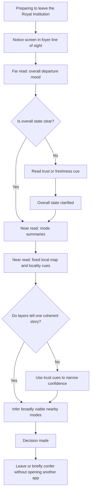
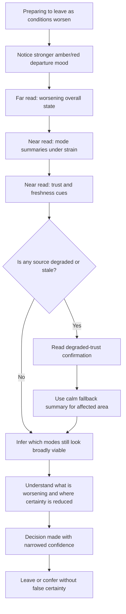
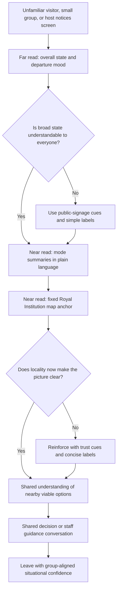

# UX Design Specification bmad-6-workshop-migration

**Author:** Workshop
**Date:** 2026-03-18

---

<!-- UX design content will be appended sequentially through collaborative workflow steps -->

## Executive Summary

### Project Vision

Albemarle Pulse is a Royal Institution-hosted foyer display that gives visitors fast situational confidence at the point of departure. From a UX perspective, the product must feel beautiful, clear, calm, restrained, and architectural at first glance. It should be absorbed as part of the foyer before it is experienced as software.

The UX goal is not to help users plan a journey. It is to replace fragmented private app-checking with one shared, local, fact-only view of what leaving from here feels like right now. The screen must communicate the departure picture in seconds, stay Royal Institution-specific, and preserve composure unless extra utility is truly essential to the departure moment.

The deepest problem is the absence of a shared situational view at the moment people are preparing to leave. Travel stress is a downstream effect. The UX therefore has to create one trustworthy, public, immediately legible surface that makes uncertainty smaller without becoming noisy, prescriptive, or app-like.

### Target Users

The primary audience is Royal Institution visitors preparing to leave the building, represented by people like Sarah Malik: attendees who want a quick, trustworthy read of local conditions without opening multiple apps or starting a route-planning task. They are using the venue as one stop within a larger London day and need fast orientation rather than exhaustive transport detail.

The audience should be treated as fully mixed in expertise. Many users will be digitally confident, but the experience must not depend on London transport fluency, local knowledge, or patience. It has to work equally well for visitors who know the city well, visitors who are unfamiliar with the network, and small groups trying to make a shared departure decision.

Secondary users include front-of-house staff and event hosts who benefit from the screen as a shared factual reference, and a lightweight venue-side operator who needs to confirm that the display is current, stable, and trustworthy enough for public use.

### Key Design Challenges

The first challenge is designing for two reading distances within one composition. In 2-3 seconds from across the foyer, users must understand whether the departure picture is broadly calm, strained, or disrupted, and whether the screen appears trustworthy. At closer range, the same screen must reward inspection with factual clarity about nearby modes, weather, and local relevance.

The second challenge is preserving composure while presenting live, multi-source information. Albemarle Pulse has to combine weather, mobility status, trend, and trust cues into one calm surface without feeling like a dashboard, route planner, or live-ops monitor. Too much detail and too much switching are already the problem, so the UX must make synthesis easier rather than expose more operational complexity.

The third challenge is creating a public display that works for a mixed audience. The design cannot rely on transport fluency, app habits, or individual interaction. It must support one-glance clarity, shared group readability, and emotional calm in that order, while still remaining honest under disruption or degraded data.

A final challenge is environmental credibility. Even though the MVP runs on a laptop, it must not feel like a prototype or throwaway demo. The UX has to feel intentional and venue-native enough to behave like part of the Royal Institution itself.

### Design Opportunities

The strongest opportunity is to create an ambient-first display that improves the foyer before anyone consciously engages with it. If the screen communicates the room's departure mood almost subconsciously, it becomes part of the architecture and not just another digital tool.

A second opportunity is to outperform personal apps through shared readability rather than greater feature depth. Albemarle Pulse can be more useful than fragmented phone-checking by giving individuals, groups, and staff one composed factual reference that everyone can understand at the same time.

A third opportunity is to use visual hierarchy as the core UX differentiator. A strong atmospheric first read, a fixed local map, fact-only mode comparison, and selective trust/trend cues can create a distinctive design language that feels calm, local, and specific to the Royal Institution.

A fourth opportunity is to make beauty functional. The architectural first impression, restrained motion, and disciplined composition are not ornamental; they are how the product earns trust, reduces cognitive load, and makes people feel that the display belongs in the venue.

## Core User Experience

### Defining Experience

The defining experience of Albemarle Pulse is `glance, orient, decide`. Users do not come to the screen to operate software, enter a destination, or explore options. They look up to understand the departure picture from here, right now, and to decide what to do next with minimal effort.

The most important action to get right is understanding, within seconds, whether leaving the Royal Institution feels broadly calm, strained, or disrupted, and which modes still look viable without entering a route-planning task. If that read is immediate and trustworthy, the rest of the product succeeds.

This means Albemarle Pulse is fundamentally an ambient public display rather than an interactive transport tool. Its value starts before deliberate use. The experience should feel like a composed part of the foyer that already contains the answer users were about to reconstruct for themselves across several private apps.

### Platform Strategy

The MVP should be designed as a non-interactive ambient viewing experience in a controlled browser environment on a laptop driving a fixed landscape public display. Public users should not need touch, click, scroll, or any direct interaction to get value from the product.

Mouse and keyboard interaction should exist only for setup, maintenance, and recovery. This keeps the public-facing experience disciplined and protects the product's identity as a shared foyer instrument rather than a kiosk or personal utility app.

True offline functionality is not required for MVP. Instead, the experience should support honest last-known state presentation and graceful degraded behavior when one source is delayed or unavailable. The platform strategy therefore prioritizes long-running stability, readability from across the foyer, calm live updates, and controlled operational behavior over feature breadth.

### Effortless Interactions

The most important effortless interaction is the room-scale read. Users should be able to understand the overall departure mood in 2-3 seconds from across the foyer without approaching the screen, interpreting dense detail, or learning a new interface.

Trust should also feel effortless. Users should not have to figure out which source is reliable, what is stale, or whether the display is still safe to believe. Live updates, freshness cues, trend changes, and degraded-source behavior should all happen automatically and honestly within the interface.

Shared readability is another key effortless behavior. Small groups should be able to look at the same screen and reach a common understanding without one person acting as translator. The design should eliminate app switching, destination entry, mode filtering, deep exploration, and source-comparison work entirely from the core experience.

The delightful moment is when a single shared glance gives an individual or group immediate situational confidence.

### Critical Success Moments

The first critical success moment happens across the room. A user looks up for 2-3 seconds and immediately understands the departure mood from here, now. That first impression has to communicate calm, strain, or disruption while also signaling that the display appears trustworthy.

The second critical success moment happens at closer range, when the user confirms the overall picture through factual detail about nearby modes, weather, trust cues, and local relevance just before leaving. The far read creates orientation; the near read confirms action.

Several failure modes would ruin the experience. The product fails if it reads like a dashboard or demo instead of part of the building, if it cannot be understood from a distance, or if degraded data undermines trust in the whole screen. Because the product is ambient-first, failure in first impression or credibility is more damaging than the absence of extra features.

### Experience Principles

- Design for `glance, orient, decide` as the core loop.
- Make the first read ambient, room-scale, and trustworthy before supporting closer inspection.
- Treat the screen as a public architectural surface, not a transport app or kiosk.
- Keep the main experience non-interactive for visitors; interaction exists only for setup and recovery.
- Automate live updates, trust signaling, trend visibility, and graceful degradation so users do not manage system complexity themselves.
- Prioritize one-glance clarity, shared group readability, and emotional calm over additional utility unless that utility is essential to the departure moment.
- Use close-up detail only to confirm and deepen the first impression, never to replace it.

## Desired Emotional Response

### Primary Emotional Goals

The primary emotional goal of Albemarle Pulse is calm shared confidence. When users notice the screen, they should feel quietly impressed, calm, and immediately willing to trust it. During the core `glance, orient, decide` experience, they should feel oriented, unhurried, confident, and socially aligned with the people around them.

After getting the answer they need, users should feel lighter, reassured, and ready to leave. The product should reduce low-grade departure anxiety without becoming theatrical or overly reassuring. It succeeds emotionally when confidence replaces private uncertainty and the screen feels like part of the venue rather than a software tool demanding attention.

What differentiates Albemarle Pulse from transport apps and route planners is not speed alone, but composed public trust. The emotional signature is calm shared confidence rather than private optimization.

### Emotional Journey Mapping

At first discovery, the screen should create a sense of quiet impression and immediate legibility. It should look beautiful and intentional enough that users instinctively feel it belongs in the foyer and may be worth trusting before they read it closely.

During the main interaction, the emotional experience should shift into orientation and reassurance. The user should feel that the situation has become clearer without effort, and that the screen is helping them understand the departure picture rather than adding more complexity.

After the task is complete, the user should feel lighter and more ready to move. The product should leave behind a sense of mental relief and calm confirmation rather than the residue of another digital task.

If conditions worsen or data is degraded, the emotional goal changes slightly but remains stable. Users should feel informed and steady rather than alarmed. Trust may narrow because one source is weaker or conditions are worse, but the display should make that reduction in certainty feel honest and manageable rather than destabilizing.

On repeated use, the enduring emotional quality should be calm trustworthiness with quiet elegance.

### Micro-Emotions

The most important micro-emotions for Albemarle Pulse are:
- confidence over confusion
- trust over skepticism
- calm over anxiety
- reassurance over urgency
- belonging and shared orientation over isolation

Delight matters, but only as a subtle layer on top of usefulness and composure. It should come from the first-glance beauty of the screen, the surprising ease of understanding something complex so quickly, and the feeling that the display belongs naturally in the Royal Institution.

### Design Implications

To create calm shared confidence, the UX should favor restrained hierarchy, strong legibility, stable composition, and motion that feels absorbed rather than animated. The display should read as building-native and trustworthy before it reads as technical.

To support trust, the design must present degraded or uncertain data honestly without dramatizing it. Freshness and trust cues should narrow confidence precisely where needed while preserving calm in the rest of the screen.

To create belonging and shared orientation, the screen must remain readable as a common public surface. Group readability, room-scale mood, and factual clarity should matter more than personalized depth or interactive control.

Delight should come from elegance, fit, and ease, not from novelty effects. The design should avoid anxiety, clutter, skepticism, hurriedness, confusion, or any visual behavior that makes the experience feel like a prototype, dashboard, or nagging software tool.

### Emotional Design Principles

- Design for calm shared confidence as the primary emotional outcome.
- Make first-glance trust and quiet impression part of the product's core value.
- Reduce anxiety by replacing fragmented uncertainty with one steady public read.
- Treat degraded or worsening conditions with honest composure rather than alarmist behavior.
- Let delight emerge from beauty, clarity, and fit with the venue, never from spectacle.
- Preserve a constant emotional tone of calm trustworthiness and quiet elegance across repeated use.

## UX Pattern Analysis & Inspiration

### Inspiring Products Analysis

**Apple Weather**
Apple Weather is valuable as a reference for its atmospheric first read, calm hierarchy, and low-effort clarity. It gives users a mood before it gives them detail, which is directly relevant to Albemarle Pulse's need to communicate the departure atmosphere from across the foyer before users inspect specific modes or trust cues. Its visual restraint, consistent hierarchy, and clear progression from broad state to supporting detail make it a strong model for room-scale readability followed by closer factual inspection.

**Flighty**
Flighty is a strong reference for honesty under changing conditions and for the way it turns volatile operational information into user confidence rather than noise. Its value is not just status visibility, but status prioritization: it makes clear what changed, what matters, and what is uncertain. For Albemarle Pulse, this is directly relevant to trend visibility, freshness handling, disruption honesty, and the need to preserve trust even when conditions deteriorate or one source weakens.

**TfL wayfinding and line-status signage**
TfL's public wayfinding and status signage is the most relevant reference for shared public readability. It is built for mixed audiences in motion, designed to be understood quickly at a distance, and trusted because it feels familiar, direct, and physically usable in public space. This makes it the strongest model for Albemarle Pulse's public-display character, especially its need for shared orientation, distance legibility, and calm factual clarity without app-like interaction.

### Transferable UX Patterns

**Atmospheric overview before detail**
Borrow the Apple Weather pattern of leading with a broad, emotionally legible conditions read before exposing supporting factual detail. In Albemarle Pulse, this becomes the atmospheric conditions header and room-scale first impression.

**Status hierarchy under volatility**
Borrow the Flighty pattern of making changing or uncertain conditions legible through clear hierarchy rather than dense explanation. In Albemarle Pulse, this supports selective freshness cues, trend visibility, and disruption handling that narrows trust honestly without making the screen feel alarmist.

**Public readability and shared orientation**
Borrow the TfL signage pattern of designing for fast reading by mixed audiences in physical motion. In Albemarle Pulse, this supports high-distance legibility, shared group readability, familiar status grammar, and a non-interactive main screen.

**Broad state first, specifics second**
Across all three references, a strong common pattern is sequencing: users first get the overall state, then the most relevant supporting specifics. That sequencing maps directly to Albemarle Pulse's `glance, orient, decide` loop.

**Trust through restraint**
Another shared pattern is that trust comes from composure, not visual intensity. Apple Weather uses calm clarity, Flighty uses explicit prioritization, and TfL signage uses familiar directness. Albemarle Pulse should combine those into a restrained but authoritative foyer instrument.

### Anti-Patterns to Avoid

- Do not adopt Citymapper-style route-planning behavior, destination entry, or prescriptive next-step logic.
- Do not adopt dense airport departure-board behavior with high information volume, scanning burden, or operational sprawl.
- Do not adopt generic kiosk UI conventions that imply touch-first exploration or transactional interaction.
- Do not adopt smart-city dashboard patterns that foreground metrics, monitoring density, or control-room aesthetics.
- Do not let motion, live updates, or disruption states turn the screen into an alerting surface or demo-like artifact.

These anti-patterns all create the wrong user posture: they make the product feel busy, instrumental, or software-like rather than calm, shared, and building-native.

### Design Inspiration Strategy

**What to adopt**
- Adopt Apple Weather's atmospheric first read and calm information hierarchy because they support the room-scale mood field and low-effort comprehension.
- Adopt Flighty's status honesty and prioritization because they support trustworthy live conditions, selective freshness, and clear disruption handling.
- Adopt TfL signage's public readability and shared orientation logic because they align with mixed-audience foyer use and non-interactive public display behavior.

**What to adapt**
- Adapt atmospheric visual language so it remains architectural and venue-appropriate rather than overly consumer-app-like.
- Adapt Flighty's clarity under volatility without importing a high-intensity alerting tone.
- Adapt TfL's familiar public information grammar into a more elegant, more composed, Royal Institution-specific visual language.

**What to avoid**
- Avoid planner-like density, operational board overload, kiosk interaction patterns, and dashboard theater because they conflict with the product's emotional goals and core experience.
- Avoid any pattern that makes the screen feel like a prototype, a control room, or a nagging software tool.

This inspiration strategy keeps Albemarle Pulse rooted in proven UX patterns while protecting what makes it unique: a calm, local, fact-only, shared foyer display that feels like part of the building.

## Design System Foundation

### 1.1 Design System Choice

Albemarle Pulse should use a hybrid design system: a bespoke display system built on top of lightweight primitives. The viewer-facing experience should feel custom, architectural, and specific to the Royal Institution context, while the implementation underneath can rely on a minimal primitive layer for layout structure, accessibility support, and development efficiency.

This is not the right product for a heavy app-style component library. The main experience is a single, narrow foyer display rather than a multi-screen business application, and its value depends on emotional tone, composure, and building-native presence rather than on standard UI conventions.

### Rationale for Selection

This approach best matches the project's priorities: balance, weighted toward uniqueness and composure over raw speed. A fully custom system would create unnecessary overhead for a small team, while an established app-oriented design system would import the wrong visual assumptions and interaction patterns.

A hybrid model gives Albemarle Pulse the freedom to look bespoke to the viewer while staying practical to build and maintain. It supports the product's need for:
- a calm, architectural first impression
- non-app-like public-display behavior
- custom hierarchy for room-scale reading and close-up confirmation
- restrained, display-specific status and motion language
- a small set of highly specific UI patterns instead of a broad general-purpose component library

Because there are no strict Royal Institution brand rules at this stage, the design system should follow a broader direction of elegance, calm, trustworthiness, and building-native restraint rather than logo-led branding.

### Implementation Approach

The implementation should start with lightweight UI primitives rather than a visually opinionated framework. Those primitives should support structural consistency and accessibility, but the actual display language should come from a small internal system of custom tokens and bespoke display patterns.

The system should focus on the limited set of elements the product truly needs:
- typography for room-scale and near-distance reading
- spacing and layout rhythm for stable hierarchy
- status tokens for calm, trustworthy condition signaling
- motion rules for absorbed live updates
- atmospheric header patterns
- mode summary patterns
- map framing patterns
- freshness and trust cue patterns

This keeps the system narrow and product-specific. The goal is not to build a reusable enterprise design system, but to define a disciplined display language for one high-value screen.

### Customization Strategy

Customization should be led by design tokens first, components second. The foundational layer should define the product's visual and behavioral grammar through custom tokens for type scale, spacing, color, contrast, status states, motion timing, and surface treatment.

On top of those tokens, Albemarle Pulse should use bespoke display patterns rather than generic app components. The most important patterns to define early are:
- atmospheric conditions header
- overall state and trend language
- fact-only mode summary blocks
- fixed local map container and overlays
- freshness and degraded-trust indicators
- room-scale versus close-read hierarchy rules

The viewer should experience the result as one composed foyer instrument, not as a themed version of an existing framework. Lightweight primitives should remain invisible in the final character of the product.

## 2. Core User Experience

### 2.1 Defining Experience

The defining experience of Albemarle Pulse is: seeing, at a glance, what leaving the Royal Institution feels like right now without opening multiple apps. If a visitor described the product to a friend, that is the sentence they should use.

This experience is built around one shared public screen rather than a private tool. Users do not arrive to plan a route or manipulate software. They look up, orient to the departure picture from here and now, confirm the details they need, and decide what to do next. If this feels immediate and trustworthy, the product succeeds.

The product becomes special when a broad atmospheric read is available in seconds and closer inspection only confirms that impression rather than complicating it.

### 2.2 User Mental Model

Today, users usually solve this problem by checking several private tools in sequence: weather, Maps, TfL, Citymapper, and sometimes the opinions of the people they are with. They compare signals, deal with conflicting or stale information, and often leave only partly confident.

The mental model users bring is not "I want to use a new mobility interface." It is "I need a quick trustworthy sense of what it will be like to leave from here right now." They expect familiarity, legibility, and quick synthesis rather than exploration.

Current tools feel magical when one of them provides a fast trustworthy status or a familiar map immediately. They feel terrible when they require switching, destination entry, too much private detail, unclear freshness, conflicting information, or too much effort at exactly the wrong moment.

### 2.3 Success Criteria

The core experience succeeds when one shared glance gives users a trustworthy overall read, and the closer details only confirm that read rather than complicate it.

Users should feel "this just works" when:
- the overall state is immediately legible as calm, strained, or disrupted
- nearby viable modes can be inferred without entering a route-planning task
- the headline, mode summaries, map, and freshness or trust cues all reinforce the same picture
- the experience feels faster and calmer than checking multiple private apps

Target pace for the experience:
- across-room orientation: 2-3 seconds
- close-up confirmation: 5-10 seconds

The following should happen automatically without user action:
- live updates
- freshness and trust signaling
- trend shifts when they materially matter
- degraded-source handling
- calm motion and stable visual response to change

### 2.4 Novel UX Patterns

Albemarle Pulse does not depend on a brand-new interaction users need to learn. Instead, it combines familiar patterns in a new way:
- public signage and wayfinding readability
- an atmospheric first read before detail
- a fact-only anti-planner contract
- a fixed local venue-centered map
- honest trust and freshness cues

This combination is the innovation. Users should not need instruction because each ingredient feels legible on its own, but together they create a different kind of mobility experience: a calm shared foyer instrument instead of a route-planning screen or operational dashboard.

### 2.5 Experience Mechanics

**Initiation**
The interaction begins when a visitor is preparing to leave and notices the screen in their line of sight within the foyer.

**Interaction**
Users read the overall mood and state first.
They read the mode summaries second.
They read the map and freshness or trust cues third, if needed.

**Feedback**
Users know they are reading the display correctly when all layers tell one coherent story. The overall state, mode summaries, fixed map, and trust cues should not contradict each other. Group agreement should also come easily because the screen is shared and legible.

**Completion**
Users know they are done when they can answer two questions with confidence:
- does leaving feel calm, strained, or disrupted right now?
- which nearby modes still look viable?

At that point, they leave or briefly confer with others without needing a prescribed route or deeper interaction.

## Visual Design Foundation

### Color System

The color system should be built around a light architectural neutral base: stone, parchment, and civic off-whites, supported by restrained charcoal for text and structural contrast. The palette should feel public, calm, and quietly institutional rather than glossy, consumer-app-like, or exhibition-dramatic.

Accent color should be used sparingly. A small set of mineral or bronze tones can provide warmth and distinction, especially in separators, map framing, or subtle emphasis moments, but they should never overpower the main informational structure.

Status colors should follow a muted, sophisticated green / amber / red grammar rather than highly saturated utility colors. These status hues should feel trustworthy and legible without making the screen feel alarmist or dashboard-like. Their job is to communicate condition clearly while staying within the broader composed atmosphere of the product.

The atmospheric background should shift only subtly with changing conditions. Changes in weather or overall mobility mood should influence tonal balance and surface treatment rather than radically recolor the whole screen. The overall effect should be that the screen feels alive and situational without ever becoming theatrical.

### Typography System

Typography should feel architectural and institutional with a light editorial edge. The tone should be serious and public-facing rather than gallery-like, decorative, or overtly branded. It should suggest that the display belongs in an important civic-cultural venue.

The typographic system should be strongly biased toward very large display type and minimal small text. The screen's hierarchy must work first at room scale, so the primary condition read, key mode states, and top-level structural elements should be set in large, highly legible type with strong contrast and disciplined spacing.

Secondary typography should support close-up confirmation without creating a text-heavy interface. Supporting detail should remain concise, factual, and easy to scan, with minimal reliance on dense labels or paragraph-style reading.

The type scale should be explicitly hierarchical:
- large display scale for overall state and atmospheric header
- strong secondary scale for mode summaries and key factual confirmations
- restrained small scale only for freshness, trust, or support labels where absolutely necessary

### Spacing & Layout Foundation

The layout should be airy and spacious, using a strong grid with a 12px base rhythm scaled up for display use. The screen should feel composed and architectural, with enough breathing room that viewers can parse structure from a distance.

A strong grid is important because the product depends on coherence across multiple reading layers: overall state, mode summaries, fixed local map, and trust cues. The layout should create visible order before users consciously read content.

Spacing should be used to separate levels of meaning rather than just to decorate the interface. Large structural gaps should distinguish major zones such as the atmospheric header, the mode comparison field, and the map. Smaller internal spacing should create rhythm within components without making them feel cramped or overly segmented.

The layout foundation should support two reading distances:
- a room-scale read where overall hierarchy, color balance, and spatial grouping are immediately legible
- a close-up read where factual details reward inspection without disturbing the larger composition

### Accessibility Considerations

Accessibility should be treated as part of the visual language, not as a compliance layer added afterward. The screen must remain readable from across the foyer, which means high contrast, strong typographic hierarchy, restrained information density, and minimal small text.

Status must never rely on color alone. The muted green / amber / red system should always be supported by wording, structural emphasis, or iconographic cues where needed so that users can correctly interpret conditions even with reduced color discrimination.

Motion should remain subtle enough that meaning is preserved even if motion is reduced or absent. Atmospheric shifts, live updates, and trust-state changes should never rely on animation alone to communicate important information.

Freshness and degraded-trust cues should be clear but visually disciplined. They must help users understand when confidence narrows without introducing panic, clutter, or visual instability.

Overall, the visual foundation should make Albemarle Pulse feel calm, legible, trustworthy, and building-native at every distance.

## Design Direction Decision

### Design Directions Explored

The design exploration tested six distinct directions for Albemarle Pulse through the HTML showcase at `docs/ux-design-directions.html`. Each direction used the same product doctrine and visual foundation while varying layout emphasis, status hierarchy, map role, and atmospheric weight.

The explored directions were:
- **Direction 01: Atmospheric Band** - strongest atmospheric first read with a balanced factual split
- **Direction 02: Civic Instrument** - strongest shared public readability and institutional clarity
- **Direction 03: Map Anchor** - strongest local frame and venue-specific spatial identity
- **Direction 04: Public Ledger** - most explicit and report-like under disruption
- **Direction 05: Quiet Split** - most serene and editorial in tone
- **Direction 06: Signal Tapestry** - most experimental in ambient mood-field treatment

The evaluation criteria remained consistent across all directions:
- room-scale legibility in 2-3 seconds
- calm trustworthiness under live and degraded conditions
- public shared readability for mixed audiences
- a building-native rather than app-like or dashboard-like presence

### Chosen Direction

The chosen direction is **Direction 01: Atmospheric Band** as the base design system for Albemarle Pulse.

This base should be refined with:
- the shared public readability and institutional clarity of **Direction 02**
- the stronger local frame and venue-specific spatial identity of **Direction 03**
- only a light touch of the serenity found in **Direction 05**

The final direction should keep the strong atmospheric header, generous whitespace, light civic palette, and calm first impression of Direction 01 while making the fixed local map feel more architecturally framed and clearly part of the product's locality story.

The following directions or qualities should be explicitly avoided:
- **Direction 04**'s report-like density and operational-board feeling
- **Direction 06**'s more experimental ambient-field push
- any outcome that feels like a dashboard, kiosk, prototype, or art installation rather than a calm foyer instrument

### Design Rationale

Direction 01 best matches the product's core UX doctrine because it provides the clearest room-scale atmospheric read while still supporting a close-up factual confirmation. It expresses the product's main promise: users should feel the departure picture before they have to inspect details.

Borrowing from Direction 02 ensures the screen remains publicly legible and institutionally grounded. Borrowing from Direction 03 ensures the display stays visibly Royal Institution-specific rather than drifting into a generic city-status composition. Borrowing only a light touch from Direction 05 helps preserve quiet elegance without softening the product so much that it loses public authority.

Several specific design decisions follow from this rationale:
- the atmospheric header should remain strong, but it must not overpower the fixed local map
- the map should feel architecturally framed rather than cartographic or exploratory
- status and trust cues should stay quiet in tone but unmistakable in meaning
- whitespace should remain generous enough to preserve composure and room-scale readability
- the overall screen should feel like a calm foyer instrument that belongs in the building

This chosen direction is the best synthesis of beauty, trust, legibility, locality, and composure.

### Implementation Approach

Implementation should treat Direction 01 as the primary composition blueprint and refine it through a small set of deliberate adjustments rather than reopening broad visual exploration.

The next design and implementation work should focus on:
- refining the atmospheric header-to-map relationship so both feel important but non-competitive
- increasing the architectural framing and locality cues around the fixed map without turning it into a dominant cartographic surface
- strengthening the public-signage clarity of mode summaries, labels, and status states
- tuning trust and freshness cues so they remain restrained but impossible to miss when confidence narrows
- preserving the light civic palette, large display typography, and generous spacing as non-negotiable visual foundations

This approach keeps the chosen direction stable while turning it into a production-ready foyer display language rather than a generic screen layout.

## User Journey Flows

### Royal Institution Attendee - Primary Departure Confidence Flow

This flow covers the main success path for a typical attendee preparing to leave the Royal Institution. The experience begins when the visitor notices the screen while heading toward departure. Success happens when the user understands within 5-10 seconds what leaving feels like right now and which nearby modes look broadly viable, without opening another app.

The biggest risk in this flow is unclear hierarchy or unclear freshness. The recovery pattern is therefore not additional interaction, but explicit trust and freshness cues that preserve the calm overall read while helping the user understand where confidence narrows.

### Royal Institution Attendee - Worsening or Degraded Conditions Flow

This flow covers the hardest UX case: the visitor sees conditions shifting toward amber or red as departure begins, and one source may be stale or degraded. Success happens when the user understands that conditions are worsening, what still looks broadly viable, and where confidence has narrowed.

The biggest failure risk is mistaking stale or partial data for certainty. Recovery depends on honest degraded-source and last-updated cues paired with calm fallback summaries, so trust becomes narrower and more precise rather than collapsing across the whole screen.

### Unfamiliar Visitor / Shared Reference Flow

This flow covers an unfamiliar visitor, a small group leaving together, or a front-of-house host using the screen as a shared public reference. The core success moment is reaching a shared situational read without route guidance or private app interpretation.

The biggest failure risk is insider language or weak locality cues. Recovery depends on plain-language labels, a fixed Royal Institution map anchor, and strong public-signage clarity so the shared picture remains legible even for people without London transport fluency.

### Journey Patterns

Across these flows, several journey patterns should remain consistent:

- **Far read before near read:** the screen must always communicate the broad state first, then reward closer inspection with confirming detail.
- **Shared public interpretation:** the main surface should support individuals, groups, and staff using the same visible information at the same time.
- **Trust narrows locally, not globally:** when one signal is weaker, confidence should reduce precisely in that area without undermining the whole display.
- **Locality explained once:** the fixed Royal Institution map should anchor place clearly without becoming a dominant exploratory surface.
- **Decision by inference, not advice:** the screen helps users conclude what looks viable without prescribing a route or mode.

### Flow Optimization Principles

The journey flows should be optimized around speed, calm, and coherence:

- Room-scale orientation should happen in 2-3 seconds.
- Close-up confirmation should happen in 5-10 seconds.
- Every layer should reinforce the same story rather than forcing users to reconcile contradictions.
- Recovery should happen through calm trust clarification, not through extra steps or denser operational detail.
- Plain-language labels and public-signage structure should reduce the need for transport fluency.
- Shared readability should be treated as a first-class UX requirement, not a side effect.
- Degraded states should remain usable and honest without visually destabilizing the screen.

## Component Strategy

### Design System Components

The chosen design-system foundation is a hybrid: lightweight primitives underneath, bespoke display components on top. For Albemarle Pulse, the primitive layer should remain intentionally small and visually quiet.

**Foundation primitives available from the system**
- layout containers and section wrappers
- grid and stack primitives
- typographic primitives for display, summary, and support text
- basic surface and panel primitives
- dividers and rule lines
- icon and symbol wrapper primitives
- status token primitives
- visually hidden and screen-reader helper primitives
- staff-only setup or recovery controls

These primitives are sufficient for structural consistency, spacing, accessibility scaffolding, and token application. They are not sufficient to define the product's actual public character.

**Gap analysis**
The product needs a set of custom components that are specific to the foyer-display experience and are not well served by a standard app-oriented component library:
- atmospheric header
- mode summary block
- fixed local map frame
- freshness / trust cue
- degraded-source confirmation
- section framing / layout shell

These components are essential because the core UX depends on room-scale readability, public shared interpretation, and honest trust signaling rather than on generic UI controls.

### Custom Components

#### Atmospheric Header

**Purpose:** Deliver the room-scale from-here-now departure read and set the calm factual tone of the whole screen.

**Usage:** Always appears at the top of the main display as the first read from across the foyer.

**Anatomy:** Overall state phrase, subtle trend cue, place anchor, and atmospheric background treatment.

**States:**
- clear / calm
- watchful
- strained
- disrupted
- improving / steady / worsening trend
- degraded-confidence state

**Variants:**
- default live state
- low-confidence fallback state

**Accessibility:** Must remain legible at distance; status must not rely on color alone; trend and confidence changes must be readable through wording and structure even with reduced motion.

**Content Guidelines:** Use calm factual language; keep copy brief and non-prescriptive; avoid emotional or advisory phrasing.

**Interaction Behavior:** No visitor interaction; updates change state calmly through restrained visual shifts.

**Avoid:** Hero graphics, decorative weather theatrics, emotional copy, advertising energy, or art-installation behavior.

#### Mode Summary Block

**Purpose:** Give each nearby mode a fast fact-only viability read without drifting into route planning.

**Usage:** Repeated for the core nearby modes as the main close-up confirmation layer.

**Anatomy:** Mode label, concise state label, short factual note, optional trust or freshness nuance, and restrained status marker.

**States:**
- available
- caution
- disrupted
- unavailable
- unknown
- freshness / confidence nuance

**Variants:**
- standard mode block
- slightly expanded emphasis block for the most relevant local modes

**Accessibility:** State must be readable without color alone; copy must stay concise; hierarchy must support quick group scanning.

**Content Guidelines:** Focus on local viability and broad condition; keep detail selective and relevant to departure from here.

**Interaction Behavior:** No route selection, ranking, or expansion on the public screen.

**Avoid:** Best-route language, leaderboard ranking, dense live-board detail, citywide sprawl, or exact planning logic.

#### Fixed Local Map Frame

**Purpose:** Anchor the display physically to the Royal Institution and nearby departure geography.

**Usage:** Persistent map reference on the main screen, explaining locality once and supporting the rest of the display spatially.

**Anatomy:** Architecturally framed fixed map surface, Royal Institution anchor, nearby nodes or corridors, selective status overlays where needed.

**States:**
- normal
- locality-emphasis
- low-confidence / fallback if a layer is unavailable

**Variants:**
- default framed map
- simplified fallback map

**Accessibility:** Must remain visually secondary to the overall state while still providing clear locality cues; labels and markers must stay legible without dense detail.

**Content Guidelines:** Show only the geography needed to support nearby departure decisions; keep the map calm and non-exploratory.

**Interaction Behavior:** Fixed display only; no public pan, zoom, or route drawing.

**Avoid:** Generic city-map treatment, pan/zoom behavior, route lines, turn-by-turn cues, or cartographic dominance.

#### Freshness / Trust Cue

**Purpose:** Quietly make honesty visible so users know how current and confident the information is.

**Usage:** Appears inline in normal conditions and becomes more explicit only when confidence narrows materially.

**Anatomy:** Concise label, last-updated or trust wording, and subtle visual emphasis scaled to severity.

**States:**
- fresh
- aging
- stale
- partial
- degraded

**Variants:**
- inline quiet label
- stronger local callout when confidence narrows

**Accessibility:** Must be readable without relying on subtle color differences alone; wording should remain plain and clear at close range.

**Content Guidelines:** Use plain language and short phrases; emphasize confidence and freshness, not system internals.

**Interaction Behavior:** Passive informational component; updates automatically.

**Avoid:** Technical jargon, hidden timestamps, alarm styling, or intrusive global warnings in normal conditions.

#### Degraded-Source Confirmation

**Purpose:** Explain exactly what is uncertain while keeping the rest of the screen trustworthy and usable.

**Usage:** Appears only when a specific source or area has reduced confidence that affects interpretation.

**Anatomy:** Local explanation of what is uncertain, fallback wording, and scope cue showing what remains unaffected.

**States:**
- single-source degraded
- multiple-source degraded
- recovering
- temporarily unavailable

**Variants:**
- local inline confirmation on affected components
- restrained global note only when degradation changes the whole read

**Accessibility:** Must remain plain, visible, and non-catastrophic; unaffected data should remain legible and not be visually drowned by the warning state.

**Content Guidelines:** Be precise about what is uncertain and what is still trustworthy.

**Interaction Behavior:** Passive informational state; no error-resolution action required from public viewers.

**Avoid:** Generic error messaging, catastrophic tone, or invalidating unaffected data.

#### Section Framing / Layout Shell

**Purpose:** Create the calm architectural hierarchy that makes the screen feel like a foyer instrument rather than software.

**Usage:** Defines the overall composition of header, mode field, map frame, and supporting trust layers.

**Anatomy:** Main landscape shell, structural zones, spacing rhythm, and section framing rules.

**States:**
- normal composition
- heightened-strain composition
- compact full-screen laptop-demo composition

**Variants:**
- single canonical landscape layout
- compact-height fallback for smaller display height

**Accessibility:** Must preserve hierarchy, spacing, and reading order at different viewing distances; should not rely on decorative contrast or dense card segmentation.

**Content Guidelines:** Use whitespace and structure to express meaning; let major zones read clearly before their contents are inspected.

**Interaction Behavior:** Structural rather than interactive; supports calm live updates without layout churn.

**Avoid:** Card soup, over-gridded dashboard feel, glossy panel chrome, or ornamental transitions.

### Component Implementation Strategy

The implementation strategy should build all custom components on top of shared tokens and simple primitives, not on top of a heavy visual framework. Each custom component should inherit the same typography, spacing, status, motion, and surface rules so the whole screen feels like one system rather than a set of styled widgets.

Component behavior should be driven by public-display needs:
- distance readability before close-up density
- passive state communication before interaction
- local trust clarification before global warning
- architectural framing before card-style segmentation

Accessibility must be treated as part of every component definition. Because the main audience is viewing rather than interacting, the most important accessibility behaviors are high contrast, non-color status encoding, restrained motion, plain-language state labels, and clear hierarchy. Keyboard support should focus on staff-only setup and recovery surfaces rather than public display components.

The component set should remain deliberately small. If a new component does not materially improve the departure moment, it should not be added to the MVP display language.

### Implementation Roadmap

**Phase 1 - Core Components**
- Atmospheric Header
  Needed for the room-scale first read and the main departure thesis.
- Mode Summary Block
  Needed for the close-up factual confirmation and mode comparison.
- Section Framing / Layout Shell
  Needed to establish the overall architectural hierarchy of the screen.

**Phase 2 - Locality and Trust Components**
- Fixed Local Map Frame
  Needed to anchor the screen physically to the Royal Institution and explain locality once.
- Freshness / Trust Cue
  Needed to keep confidence visible without cluttering the whole interface.

**Phase 3 - Degradation and Stress Handling**
- Degraded-Source Confirmation
  Needed to preserve honesty and usability under partial or failing source conditions.
- Heightened-strain shell adjustments
  Needed to ensure the same composition remains calm but unmistakable during worse conditions.

This roadmap reflects journey criticality: first establish the far read and close-up read, then strengthen locality and trust, then refine degraded-condition behavior without changing the product's core calmness.

## UX Consistency Patterns

### Button Hierarchy

Public viewers should not encounter normal application button hierarchies on the main display. The public screen remains passive, ambient, and fact-only.

Button hierarchy is only relevant for staff-only setup, recovery, or secondary operational contexts. In those contexts, the hierarchy should be minimal and calm:
- **Primary action** for returning the screen to normal public service or confirming a recovery step
- **Secondary action** for non-destructive supporting actions such as retry, refresh, or inspect current status
- **Tertiary action** for low-priority navigation or dismissal in staff-only contexts

Button styling should remain restrained and infrastructural rather than product-marketing oriented. Even in staff states, controls should feel like maintenance utilities for a public instrument, not like consumer app calls to action.

**Pattern rules**
- Do not place action buttons on the public-facing main display.
- Use one clear primary action per staff-only recovery view.
- Avoid multiple competing primary actions.
- Use plain-language labels such as `Return to Display`, `Retry Source Check`, or `Dismiss Notice`.
- Maintain keyboard-safe focus order for all staff-only controls.

### Feedback Patterns

Feedback is a core part of the product because the display's value depends on trust, clarity, and calm under change. Feedback should therefore be passive, legible, and integrated into the composition rather than delivered through app-like notifications.

**Primary feedback types**
- overall state feedback
- trend feedback
- freshness and trust feedback
- degraded-source feedback
- recovery feedback in staff-only contexts

**Pattern rules**
- Overall state should always be the strongest feedback layer.
- Trend should appear as a secondary signal that becomes more visible only when it materially changes interpretation.
- Freshness and trust cues should stay quiet in normal conditions and become more explicit only when confidence narrows.
- Degraded-source confirmation should be local first, global only when the whole read is affected.
- Feedback should clarify the picture, not interrupt it.

**Emotional rule**
Feedback must make users feel informed and steady rather than alarmed. Even under disruption, the screen should never behave like an alerting console.

### Form Patterns

Public forms are out of scope for the MVP. The public display should not include search, filtering, destination entry, or form-style interaction.

If staff-only setup or recovery views require inputs, they should follow minimal internal-tool conventions:
- one task per view
- plain labels
- very small number of inputs
- clear validation
- keyboard-safe operation
- no visual complexity leaking into the public screen

The default rule is to avoid introducing forms unless they are strictly necessary for staff recovery or operational setup.

### Navigation Patterns

The public screen should not behave like a navigational application. For viewers, the core pattern is a single-screen ambient experience with no visible navigation controls.

Navigation patterns are relevant only in two contexts:
- future secondary detail views
- staff-only setup, maintenance, or recovery views

**Public display navigation rule**
- No tabs, menus, breadcrumbs, or app-shell navigation on the main foyer screen.

**Secondary or staff navigation rule**
- Keep navigation shallow and obvious.
- Prefer a single back path and one clearly identified current location.
- Use direct labels rather than product jargon.
- Preserve the visual character of a calm instrument even in support contexts.

If a secondary detail view is introduced later, it should feel like a deeper inspection layer behind the main screen, not like a different application.

### Additional Patterns

#### Loading Patterns

Loading should preserve composure and structure. The screen should not flash, jump, or expose raw loading mechanics in a way that breaks trust.

**Pattern rules**
- Keep the layout shell stable while data loads or refreshes.
- Prefer placeholder continuity over empty resets.
- Use soft transitions rather than visible redraw behavior.
- Where possible, preserve the last trustworthy structure while fresh data resolves.

Loading should feel absorbed into the product's normal life rather than announced as a technical event.

#### Empty, Fallback, and Partial States

Empty states should be rare on the public screen. If data is unavailable, the product should prefer calm fallback states over blank areas wherever possible.

**Pattern rules**
- Show last-known or partial state only when clearly marked as reduced-confidence information.
- Replace missing detail with concise fallback summaries rather than blank modules.
- Keep unaffected areas fully readable and trustworthy.
- Make the scope of missing information explicit.

The product should never imply that the whole system is broken when only one layer is missing.

#### Modal and Overlay Patterns

Public modals and overlays should be avoided on the main screen. They would interrupt the ambient read and make the display feel like software rather than a building surface.

If modals or overlays are needed in staff-only recovery contexts:
- they should be used sparingly
- they should interrupt only for true operational necessity
- they should contain one clear task
- they should be dismissible or recoverable by keyboard
- they should never appear in normal public use

The default pattern is inline explanation before modal interruption.

#### Custom Pattern Rules

Across all consistency patterns, Albemarle Pulse should follow these rules:
- Preserve the main screen as a single ambient public surface.
- Prefer local clarification over global interruption.
- Use plain-language public information patterns over app conventions.
- Let trust narrow precisely where needed instead of collapsing across the whole screen.
- Keep operational or staff-only patterns clearly separated from the public display language.

## Responsive Design & Accessibility

### Responsive Strategy

Albemarle Pulse should use a display-first responsive strategy with usable desktop browser adaptation. The primary design target is a fixed landscape foyer display running in a controlled browser environment on a laptop. The product should be designed first for that architectural public-screen context, not for handheld or touch-first use.

A secondary desktop adaptation should exist so the product remains usable in nearby desktop-browser contexts, especially for design review, validation, or local operation. This adaptation should preserve the same overall hierarchy and visual language, not become a different interface pattern.

Tablet and mobile are explicitly out of scope for the MVP. They may be technically viewable later, but they are not designed surfaces in the first release and should not drive layout or information-priority decisions.

### Breakpoint Strategy

The breakpoint model should be custom and display-first rather than based on standard consumer-device breakpoints.

**Primary display target**
- `1366px+` width
- fixed landscape orientation
- full foyer-display composition with atmospheric header, mode field, map frame, and trust layers

**Compact landscape fallback**
- activated when height is constrained on the laptop or similar display surface
- preserves the same composition but tightens vertical spacing, reduces non-essential support text, and protects the far-read hierarchy

**Secondary desktop adaptation**
- around `1024px+`
- remains usable for desktop-browser review or operation
- keeps the same interaction model and information order, but may reduce spacing or rebalance columns for a smaller desktop viewport

**Below 1024px**
- not a designed MVP surface
- no requirement to create a mobile or tablet-first layout for the first release

This breakpoint strategy protects the product's identity as a foyer instrument while still allowing practical browser-based use during development and operation.

### Accessibility Strategy

Accessibility should target WCAG AA where applicable, combined with additional public-display rules specific to Albemarle Pulse's use case.

**Core accessibility requirements**
- distance readability across the foyer
- high contrast between text, surfaces, and key status information
- status never conveyed by color alone
- meaning preserved when motion is reduced or absent
- keyboard-safe staff recovery and setup views
- plain-language labels that do not depend on London transport fluency
- no critical information communicated only through motion or color

The main accessibility priority is not form interaction or mobile gestures, but public legibility and trustworthy interpretation across different viewing conditions and user backgrounds. Accessibility therefore needs to be built into typography, spacing, hierarchy, wording, status encoding, and motion design from the start.

### Testing Strategy

Testing should focus on the actual operating context of the MVP rather than on broad consumer-device coverage.

**Primary testing focus**
- real-device testing on the laptop and target display
- desktop browser checks in Chrome, Safari, and Edge where practical
- keyboard-only testing for staff-only setup and recovery states
- contrast and color-blindness validation
- reduced-motion testing to ensure meaning does not depend on animation
- optional screen reader testing for staff-only support or recovery views

Testing should validate both viewing distances:
- room-scale first read
- close-up factual confirmation

It should also explicitly test degraded-source and fallback states, because those are part of the product's core trust model rather than edge-case polish.

### Implementation Guidelines

Responsive implementation should preserve one canonical public-display layout rather than attempting to create multiple product modes. The display-first composition is the source of truth, and fallback layouts should only compress or rebalance that composition, not reinterpret the product.

**Responsive implementation rules**
- preserve reading order across all supported desktop/display sizes
- protect the atmospheric header, mode summaries, and local map as the core layout pillars
- reduce support detail before reducing primary hierarchy
- use relative sizing and spacing carefully, but keep the display feeling deliberate rather than fluid in a generic web-app sense

**Accessibility implementation rules**
- use semantic structure where applicable, even for a mostly ambient display
- support non-color state encoding with wording and structural emphasis
- ensure focus visibility and keyboard recovery for staff-only controls
- avoid motion-dependent meaning
- maintain contrast and legibility standards across all states, including calm, strained, disrupted, and degraded-confidence views

The implementation should treat public-display accessibility as part of the product's character: calm, readable, and trustworthy at every distance and under every important condition.
